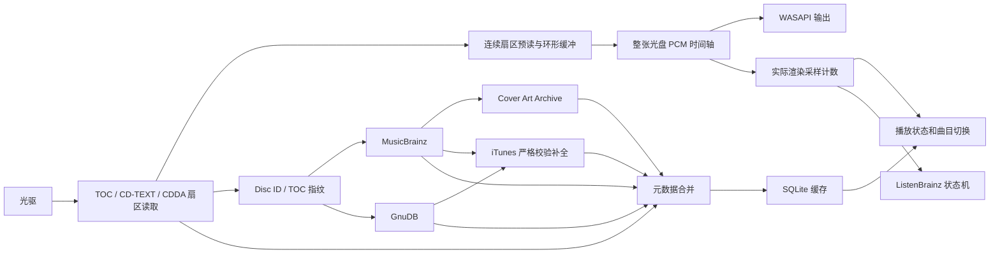

# CD.404 产品与工程规划

> 文档状态：0.2.0-public-beta.1 实施同步（2026-08-09）
> 目标平台：Windows 10/11
> 首发架构：x64
> 文档语言：简体中文

## 1. 项目概述

CD.404 是一款面向 Windows 10/11 的轻量原生音频 CD 播放器。产品强调插入即播、界面克制、离线可用、音频链路透明，并把“采样级无缝播放”作为必须经过自动化验证的核心能力，而不是仅凭听感宣称的特性。

首版聚焦以下四项能力：

1. 使用 Windows 原生接口可靠读取和播放音频 CD。
2. 从 CD-TEXT、MusicBrainz、GnuDB、iTunes 和 Cover Art Archive 获取并合并元数据。
3. 向 ListenBrainz 上报正在播放状态和符合规则的正式播放记录。
4. 将整张光盘建模为连续 PCM 时间轴，实现相邻曲目之间不丢样、不插样、不重启输出流的无缝播放。

网络不可用、元数据服务超时或 ListenBrainz 上报失败均不得阻塞本地播放。

## 2. 产品目标与原则

### 2.1 产品目标

- 插入 CD 后尽快显示本地可取得的曲目结构并允许立即播放。
- 元数据在后台异步补全，网络请求不影响播放控制响应。
- 同一张 CD 连续播放时保持单一读取管线和单一音频输出流。
- 默认提供高兼容性的 WASAPI 共享模式，并提供可明确识别的独占直通模式。
- 支持 ListenBrainz 正在播放、正式播放记录和断网补报。
- 冷启动、内存、安装体积和后台活动保持在原生轻量应用的合理范围内。
- 所有外部数据均有缓存、来源标识和可恢复的错误处理。

### 2.2 工程原则

- 音频核心与 UI 分离。
- 光盘读取、元数据和上报均通过明确接口隔离。
- 以已经实际送入音频设备的采样位置作为播放事实来源。
- 不在实时音频线程中进行网络、磁盘数据库、图像解码或日志格式化。
- 所有外部 API 均允许替换，并为测试提供本地模拟实现。
- 对不能同时满足的目标做显式取舍，不用静默音频修饰掩盖读取错误。
- 用户修订优先于自动获取结果，刷新元数据时不覆盖用户修改。

## 3. 范围边界

### 3.1 MVP 包含

- 光驱枚举、插盘、换盘、无盘和弹出状态检测。
- TOC、lead-out、音频轨和数据轨识别。
- CD-TEXT 读取和常见字符编码处理。
- 音频 CD 播放、暂停、停止、上一轨、下一轨和定位。
- 混合模式光盘中音频轨的安全播放，数据轨不进入音频管线。
- WASAPI 共享模式、独占直通模式和输出设备选择。
- 跨相邻音轨的采样级无缝播放。
- MusicBrainz Disc ID 精确查询及 TOC 模糊匹配。
- GnuDB/CDDB Disc ID 精确查询及协议 6 UTF-8 条目解析。
- iTunes 目录补全，并使用音轨数量、编号和 TOC 时长严格校验候选。
- 多发行版候选选择、记忆与重新选择。
- Cover Art Archive 封面获取和本地缓存。
- 元数据字段来源追踪和手动修订。
- ListenBrainz Token 配置、`playing_now`、`single` 和离线补报。
- 深色/浅色主题、Windows 媒体键和基本任务栏集成。
- 可供问题排查的诊断日志与导出功能。

### 3.2 MVP 不包含

- CD 抓轨、音频编码或文件标签写入。
- AccurateRip 校验。
- 本地文件音乐库或文件格式播放。
- EQ、响度均衡、交叉淡化、可视化和第三方 DSP 插件。
- 网络电台、DLNA、Chromecast 或其他串流输出。
- HTOA 隐藏音轨的完整支持。
- C2 错误信息、驱动器读取偏移校准和安全抓轨级纠错。
- Discogs 等需要额外授权、密钥或更复杂数据许可的来源。
- Windows 10 之前的操作系统。

## 4. 用户体验流程

### 4.1 插盘流程

1. 监听设备变化并检测可用光驱。
2. 读取 TOC，建立本地光盘和曲目结构。
3. 尝试读取 CD-TEXT，并立即显示可用标题。
4. 计算 MusicBrainz 与 GnuDB/CDDB 光盘标识，同时检查本地缓存。
5. 如果命中缓存，立即显示已确认的元数据和封面。
6. 在后台并行查询 MusicBrainz 与 GnuDB；精确匹配时自动合并，多候选时提示用户选择。
7. 获得可信专辑和艺术家后查询 iTunes，仅在音轨结构和时长校验通过时补全空字段。
8. 用户可以在互联网元数据尚未返回时直接开始播放。

### 4.2 播放流程

1. 打开光驱读取句柄，启动顺序预读。
2. 建立以整张光盘绝对采样帧为坐标的播放时间轴。
3. 初始化一次 WASAPI 输出流并预填充输出缓冲。
4. 到达曲目边界时只更新曲目元数据和 UI，不重建音频流。
5. 根据实际渲染采样数更新进度和 ListenBrainz 会话。
6. 停止、换盘或输出设备失效时有序关闭资源。

### 4.3 异常体验

- 断网：继续使用 CD-TEXT、TOC 占位名和本地缓存。
- MusicBrainz 超时或限流：后台退避重试，不弹出阻塞播放的对话框。
- ListenBrainz 失败：写入本地待上报队列，状态页显示待同步数量。
- 光驱短时读取失败：在预读缓冲耗尽前重试。
- 光盘存在不可纠正读取错误：按用户选择进入严格模式或平滑模式。
- 输出设备被移除：暂停播放并尝试切换到默认设备，未经确认不静默改变独占/共享策略。

## 5. 技术栈

### 5.1 推荐基线

- 语言：C++20。
- 构建系统：CMake。
- 编译器：Microsoft Visual C++，保留 clang-cl 兼容目标。
- UI：Win32 窗口、Direct2D、DirectWrite。
- 音频：MMDevice API、WASAPI、MMCSS。
- 光驱：Win32 文件句柄、`DeviceIoControl`、`IOCTL_CDROM_READ_TOC_EX`、`IOCTL_CDROM_RAW_READ`。
- 网络：WinHTTP。
- 数据库：SQLite。
- JSON：轻量 C++ JSON 库，具体库在技术验证后确定。
- 图像：Windows Imaging Component。
- 凭据：Windows Credential Manager 或 DPAPI。
- 测试：CTest 加轻量 C++ 单元测试框架，具体框架在项目骨架阶段确定。
- 依赖管理：优先使用 vcpkg manifest 模式，非必要依赖不引入。

### 5.2 选择原生 C++ 的原因

- Windows 光驱控制和 WASAPI 都是原生 Win32/COM 接口。
- 实时音频线程可以避免托管运行时暂停和跨语言封送。
- 不引入浏览器内核，便于控制启动时间、内存和安装体积。
- 音频核心可以独立编译为库，便于无 UI 自动化测试。

## 6. 系统架构



### 6.1 预定模块

```text
cd404_app              应用入口、窗口生命周期和模块装配
cd404_ui               Win32/Direct2D 界面、主题和交互
cd404_disc             光驱枚举、TOC、CD-TEXT、CDDA 读取
cd404_audio            连续时间轴、缓冲、WASAPI、设备管理
cd404_metadata         Disc ID、元数据合并和候选评分
cd404_online_metadata  MusicBrainz、GnuDB、iTunes 与 Cover Art Archive 客户端
cd404_listenbrainz     播放会话、上报与离线队列
cd404_storage          SQLite、缓存、设置和迁移
cd404_platform         Win32、凭据、日志、线程和通用基础设施
cd404_test_support     模拟光驱、BIN/CUE 测试源和假 HTTP 服务
```

模块间传递普通数据对象和事件，不允许 UI 直接操作光驱句柄或 WASAPI COM 对象。

## 7. 光盘与采样时间轴模型

### 7.1 CDDA 基本单位

标准音频 CD 使用 44.1 kHz、16-bit、双声道 PCM：

- 每个 CDDA 扇区为 2352 字节。
- 每个扇区包含 588 个双声道采样帧。
- 每秒包含 75 个扇区。
- 每个采样帧包含左右两个 16-bit 有符号样本。

内部统一使用 64 位 `DiscFrame` 表示从整张光盘音频时间轴起点开始的绝对采样帧位置。所有轨道起点、定位目标、播放进度和边界事件最终转换到这一坐标系。

### 7.2 建议数据模型

```text
Disc
  drive_id
  toc_hash
  musicbrainz_disc_id
  first_track
  last_track
  lead_out_lba
  tracks[]

Track
  number
  control_flags
  start_lba
  end_lba
  start_disc_frame
  frame_count
  is_audio
  pre_emphasis
  metadata
```

轨道结束位置由下一轨起点或 lead-out 计算，不使用元数据服务返回的毫秒时长裁剪实际音频。

### 7.3 连续播放约束

- 一次整盘连续播放只创建一个 CDDA 源对象。
- 一次整盘连续播放只保持一个 WASAPI 输出流。
- 环形缓冲中的单个块允许跨越轨道边界。
- 到达轨道边界不得清空缓冲、停止输出、补零或重新协商格式。
- 曲目变化由渲染游标越过轨道边界触发。
- 单独选择某一曲目相当于在整盘时间轴中定位，不产生不同的解码路径。
- 默认不应用淡入、淡出、交叉淡化或重采样。

### 7.4 缓冲策略

- 光驱顺序预读目标：10 至 30 秒音频，可根据驱动器速度和内存预算动态调整。
- 低水位触发更积极的预读，高水位限制内存使用。
- WASAPI 使用事件驱动填充，端点缓冲以稳定优先，不追求极限低延迟。
- 实时输出线程只消费已经准备好的 PCM 块，不直接访问光驱或数据库。
- 光驱读取线程使用有界重试，避免在单一坏扇区无限阻塞。

### 7.5 共享、独占与 bit-perfect

共享模式由 Windows 音频引擎混音，具有最高兼容性。它仍然可以保证轨道边界没有应用层丢样或插样，但系统可能进行采样格式转换。

独占模式尝试以 44.1 kHz、16-bit、双声道 PCM 直接打开设备。只有设备明确支持该格式、没有应用 DSP、音量链路不改变样本且未发生读取修饰时，UI 才显示“独占直通”或“bit-perfect”状态。

因此需要分别展示：

- 无缝状态：应用内部轨道边界是否连续。
- 输出状态：共享、独占直通或回退。
- 完整性状态：是否发生读取错误隐藏、转换或 DSP。

### 7.6 读取错误策略

不可纠正的光盘错误意味着无法同时保证原始样本、实时不中断和听感平滑。产品提供两种策略：

- 严格模式：有界重试后停止，报告 LBA 和错误，不生成伪造样本。
- 平滑模式：允许短静音或插值继续播放，同时撤销 bit-perfect 标记并记录错误。

首版默认使用严格模式，以确保产品不会在用户不知情时修改音频。

## 8. 元数据系统

### 8.1 数据源

1. 用户手动修订。
2. 已确认的本地发行版缓存。
3. CD-TEXT。
4. MusicBrainz 精确 Disc ID 或高置信 TOC 结果。
5. GnuDB/CDDB 精确结果。
6. 通过音轨结构和时长校验的 iTunes 结果。
7. TOC 生成的占位数据，如 `Track 01`。

封面以 MusicBrainz Release MBID 查询 Cover Art Archive，缓存 1200 像素缩略图并由界面按显示尺寸高质量缩小。

### 8.2 查询过程

1. 从 TOC 生成 MusicBrainz 查询参数、GnuDB/CDDB Disc ID 和标准 TOC 指纹。
2. 并行查询 MusicBrainz 与 GnuDB；GnuDB 按协议先执行 `query`，再对精确命中执行 `read`。
3. MusicBrainz 获取发行版、介质、曲目、录音、艺术家和所需 MBID，并对候选结果评分。
4. 合并 CD-TEXT 与高置信在线结果，获得可信的专辑/艺术家查询种子。
5. 查询 iTunes 专辑及曲目；只有专辑、艺术家、音轨数、编号和 TOC 时长差均通过校验才采用。
6. 不同来源仅补全当前仍为空的字段，唯一高置信候选自动采用，否则由用户选择。
7. 保存选择与 TOC 指纹的绑定。

MusicBrainz 请求必须使用包含应用名和版本的有效 User-Agent，并由全局限速器确保不超过官方服务要求。GnuDB 使用 HTTPS CGI、包含客户端 `hello` 标识并请求协议 6 UTF-8。iTunes 请求按官方建议限速和缓存；不使用其宣传图作为播放器封面。所有来源的 HTTP 缓存、退避和取消必须集中实现。

### 8.3 候选评分

候选评分至少考虑：

- 轨道数量是否一致。
- 每轨扇区长度或时长误差。
- CD-TEXT 专辑名、艺术家和曲名的相似度。
- 用户地区和语言偏好。
- 发行国家、日期、标签和条码。
- 具体介质是否具有对应 Disc ID。
- 是否有正面封面。

不得仅凭专辑名称自动选择发行版。

### 8.4 字段级来源与合并

每个字段保存值、来源、置信度和是否由用户锁定：

```text
MetadataValue
  value
  source
  confidence
  user_locked
  updated_at
```

用户锁定字段永远不被后台刷新覆盖。不同来源可以组合使用，例如专辑标题来自 MusicBrainz、某首曲名来自 CD-TEXT、缺失艺术家来自 GnuDB 或经校验的 iTunes，封面来自 Cover Art Archive。

### 8.5 离线策略

- TOC 和 CD-TEXT 永远可独立使用。
- 元数据和封面按 TOC 指纹缓存。
- API 错误保存简短状态，不阻塞 UI。
- 手动刷新才忽略正常缓存有效期。
- 数据库结构使用显式版本和迁移脚本。

## 9. ListenBrainz 集成

### 9.1 播放会话

每次用户启动某轨且播放请求通过本地参数校验时创建一个 `PlaySession`：

```text
PlaySession
  local_session_id
  disc_identity
  track_number
  recording_mbid
  release_mbid
  first_audible_at
  rendered_frames
  submitted_playing_now
  submitted_single
  state
```

### 9.2 上报规则

- 用户启动曲目且必需元数据可用后立即提交 `playing_now`，不等待光驱预缓冲完成。
- `playing_now` 不带正式收听时间戳，且只代表临时状态。
- 实际播放达到曲目时长的一半或 4 分钟，以较短者为准时，提交一次 `single`。
- 暂停期间不累计播放帧。
- 快进跳过的部分不累计。
- 未达到阈值就切歌或停止时不提交正式记录。
- 单曲循环每次重新开始创建新会话。
- 同一会话最多提交一次正式记录。

### 9.3 上报内容

在元数据可用时包含：

- artist_name
- track_name
- release_name
- duration
- recording_mbid
- release_mbid
- artist_mbids
- media_player
- submission_client

元数据在播放中途补全时，正式记录使用提交时可获得的最高质量数据，但不得将不同轨道的元数据混入当前会话。

### 9.4 安全与离线队列

- Token 使用 Windows Credential Manager 或 DPAPI 保存，不进入 SQLite、日志或崩溃转储。
- 待上报记录写入 SQLite 事务队列。
- 网络失败使用带随机抖动的指数退避。
- 本地会话 ID 和状态字段防止应用重启或重试造成重复提交。
- 用户可删除待上报队列、退出账号或完全关闭 ListenBrainz。

## 10. 本地存储

初步数据库表：

```text
schema_migrations
disc_cache
track_cache
metadata_values
release_candidates
cover_art_cache
listen_sessions
listen_submit_queue
app_settings
```

封面图片保存为文件，数据库只保存内容哈希、MIME 类型、尺寸、来源 URL 和访问时间。缓存清理采用容量和最近使用时间策略，不删除用户修订。

## 11. UI 规划

### 11.1 主窗口

- 顶部：光驱选择、光盘状态和弹出按钮。
- 主区域：封面、专辑标题、艺术家和发行信息。
- 曲目列表：轨号、标题、艺术家、时长和播放状态。
- 底部：上一轨、播放/暂停、下一轨、进度、音量和输出状态。
- 状态标识：共享/独占、无缝、读取错误、元数据来源、ListenBrainz 同步状态。

### 11.2 设置页

- 默认光驱和输出设备。
- 共享模式、独占直通和失败回退策略。
- 严格读取或平滑读取策略。
- MusicBrainz 地区与语言偏好。
- ListenBrainz Token、连接测试和上报开关。
- 缓存大小、日志级别和诊断导出。

### 11.3 轻量指标

首版建议预算：

- 常规冷启动目标小于 1 秒。
- 空闲常驻内存目标小于 80 MB。
- 无网络和无盘时不执行高频轮询。
- 播放时 UI 渲染不得占用实时音频线程。
- 安装包不捆绑浏览器内核或完整托管运行时。

这些数字是工程目标，需要在 P1/P2 阶段根据真实构建持续测量。

## 12. 线程与实时性

建议线程角色：

- UI 主线程：窗口消息、输入和绘制调度。
- 设备监控线程：光驱和音频设备变化。
- CDDA 读取线程：顺序扇区读取、重试和环形缓冲生产。
- WASAPI 渲染线程：事件驱动消费 PCM，注册 MMCSS。
- 网络任务线程池：MusicBrainz、GnuDB、iTunes、封面和 ListenBrainz。
- 数据库工作线程：缓存和上报队列事务。

WASAPI 渲染线程禁止：

- 等待网络或数据库。
- 获取可能被 UI 长时间持有的锁。
- 动态加载模块。
- 图像处理。
- 无界内存分配。
- 同步写日志文件。

## 13. 测试策略

### 13.1 可测试源抽象

真实光驱之外，实现仅用于开发测试的 BIN/CUE 或合成 PCM 源。它必须与真实光驱源实现相同的连续扇区读取接口，使无缝逻辑可以在没有特定实体光盘时确定性复现。

### 13.2 单元测试

- MSF、LBA、扇区和采样帧转换。
- TOC 解析和 lead-out 处理。
- CD-TEXT pack 组合、字符集和字段映射。
- MusicBrainz Disc ID 输入构造。
- GnuDB/CDDB Disc ID 与 xmcd 条目解析。
- iTunes 候选的音轨结构和 TOC 时长校验。
- 发行版候选评分。
- 字段来源合并与用户锁定。
- ListenBrainz 阈值、暂停、跳转、循环和去重。
- SQLite 迁移和离线队列恢复。

### 13.3 无缝验证

构造包含已知边界信号的测试盘镜像，例如：

- 曲目边界前后连续递增的采样序列。
- 边界前最后一个采样和边界后第一个采样分别设置为唯一哨兵值。
- 多个极短曲目连续切换。
- 缓冲块恰好落在边界、边界前一个采样和边界后一个采样。

验证条件：

- 输出采样总数与源范围完全一致。
- 边界处没有额外零值、重复采样或缺失采样。
- 轨道事件对应正确的绝对采样位置。
- 连续跨轨 100 次无应用层 underrun。
- 独占 44.1/16 输出测试中，在设备允许捕获验证时做字节级比较。

### 13.4 集成与硬件测试

建立至少覆盖以下类别的设备矩阵：

- SATA 内置光驱。
- USB 外置光驱。
- 支持和不支持 CD-TEXT 的光盘。
- 刻录盘、混合模式盘和有轻微划痕的盘。
- 支持与不支持 44.1 kHz 独占输出的声卡。
- USB DAC、板载声卡和蓝牙输出设备。

蓝牙设备通常不满足 bit-perfect 条件，但必须保证共享模式下的功能和边界连续性。

## 14. 验收标准

MVP 发布前必须满足：

1. 同一张盘连续播放相邻曲目时不重启 CDDA 源或 WASAPI 流。
2. 合成边界测试证明输出没有应用层丢样、插样和重复样本。
3. 连续跨轨 100 次，无 WASAPI underrun。
4. UI 曲目切换误差不超过一个输出缓冲周期。
5. 元数据服务断网、超时或限流不影响播放。
6. ListenBrainz 不因暂停、定位、应用重启或网络重试产生重复记录。
7. Token 不以明文形式出现在配置、数据库和日志中。
8. 光驱拔出、换盘、休眠唤醒和输出设备消失时能够安全释放并恢复资源。
9. 独占模式不可用时明确提示并按照配置回退。
10. 发生样本修饰或读取隐藏后，不继续显示 bit-perfect 状态。
11. 混合模式盘的数据轨不会被当作 PCM 播放。
12. 安装、首次运行和卸载不要求管理员权限，除非后续验证发现特定驱动器访问确有系统限制。

## 15. 实施阶段

### P0：底层技术验证，5 至 7 个工作日

目标：优先消除最高风险，不制作完整 UI。

- 枚举光驱并监听介质变化。
- 读取 TOC、lead-out 和 CD-TEXT。
- 连续读取一段或整张 CDDA 扇区。
- 以 WASAPI 共享和独占模式输出 44.1/16 PCM。
- 建立绝对采样帧时间轴。
- 使用合成源完成第一次跨轨无缝自动测试。
- 记录不同光驱的访问权限和读取行为。

完成条件：至少一台真实光驱可以稳定连续播放，并且合成源边界测试字节级通过。

### P1：音频核心，约 2 周

- 完整的预读环形缓冲和低/高水位控制。
- 播放、暂停、停止、定位和切轨状态机。
- WASAPI 输出设备选择、失效恢复和共享/独占回退。
- 光驱重试、严格/平滑错误策略。
- 输出游标和轨道事件。
- 扩充无缝、欠载和设备切换测试。

### P2：基础 UI，1 至 2 周

- 主窗口、曲目列表和播放控制。
- 光驱与输出设备选择。
- 深浅色主题和 DPI 适配。
- 媒体键、任务栏控制和基础无障碍名称。
- 状态、错误和诊断信息展示。

### P3：元数据，1 至 2 周

- Disc ID 与 MusicBrainz 客户端。
- GnuDB/CDDB 与 iTunes 补全客户端。
- 请求限速、缓存、取消和退避。
- CD-TEXT 与互联网元数据合并。
- 发行版候选评分与用户选择。
- Cover Art Archive 封面缓存。
- 手动修订和字段锁定。

### P4：ListenBrainz，约 1 周

- Token 安全存储和连接测试。
- 播放会话与准确的渲染采样计数。
- `playing_now` 与 `single`。
- SQLite 离线队列、重试和去重。
- 用户可见的同步状态与清理功能。

### P5：兼容性与发布，约 2 周

- 扩充实体光驱和音频设备矩阵。
- 休眠、热插拔、换盘和应用崩溃恢复。
- 性能、内存和启动时间优化。
- 安装包、升级与卸载验证。
- 隐私说明、第三方许可和发布检查表。

单人全职预计 7 至 10 周可完成质量较好的公开测试版，设备兼容性问题可能使时间增加。

## 16. 主要风险与缓解

| 风险 | 影响 | 缓解措施 |
|---|---|---|
| 不同光驱的数字音频提取行为不一致 | 读取失败、卡顿或数据差异 | P0 优先验证；建立设备矩阵；读取层隔离厂商差异 |
| 受损光盘导致实时读取赶不上播放 | 欠载或样本修饰 | 10 至 30 秒预读、有界重试、严格/平滑策略 |
| 独占 44.1 kHz 不受设备支持 | 无法 bit-perfect | 明确检测格式；共享模式回退；UI 展示真实状态 |
| MusicBrainz 一个 Disc ID 对应多个发行版 | 元数据选择错误 | 候选评分、用户确认并缓存选择 |
| CD-TEXT 字符集或 pack 不规范 | 乱码或字段缺失 | 保存原始 pack；多编码测试；允许手动修订 |
| ListenBrainz 网络重试产生重复记录 | 用户历史污染 | 本地会话 ID、事务状态机和幂等式队列处理 |
| 实时线程被 UI、日志或数据库阻塞 | 音频爆音 | 单向有界缓冲；禁止实时线程执行阻塞任务 |
| 功能持续膨胀破坏轻量目标 | 延期和复杂度失控 | 严守 MVP 边界，新功能通过独立里程碑评审 |

## 17. 关键技术决策记录

后续应建立 `docs/adr/`，至少记录：

1. 为什么使用整盘绝对采样时间轴。
2. 为什么首版选择 C++20 和 Win32/Direct2D。
3. 共享模式与独占直通的产品策略。
4. 光盘不可纠正错误的严格/平滑策略。
5. 元数据字段级来源和用户锁定模型。
6. ListenBrainz 会话和去重语义。
7. 测试用 BIN/CUE 源与产品功能范围的隔离。

## 18. 官方接口参考

- [IOCTL_CDROM_RAW_READ](https://learn.microsoft.com/en-us/windows-hardware/drivers/ddi/ntddcdrm/ni-ntddcdrm-ioctl_cdrom_raw_read)
- [IOCTL_CDROM_READ_TOC_EX](https://learn.microsoft.com/en-us/windows-hardware/drivers/ddi/ntddcdrm/ni-ntddcdrm-ioctl_cdrom_read_toc_ex)
- [CDROM_TOC_CD_TEXT_DATA](https://learn.microsoft.com/en-us/windows-hardware/drivers/ddi/ntddcdrm/ns-ntddcdrm-_cdrom_toc_cd_text_data)
- [Windows Core Audio API](https://learn.microsoft.com/en-us/windows/win32/coreaudio/about-the-windows-core-audio-apis)
- [WASAPI Exclusive-Mode Streams](https://learn.microsoft.com/en-us/windows/win32/coreaudio/exclusive-mode-streams)
- [MusicBrainz Web Service v2](https://musicbrainz.org/doc/Development/XML_Web_Service/Version_2)
- [MusicBrainz libdiscid](https://musicbrainz.org/doc/libdiscid)
- [Cover Art Archive API](https://musicbrainz.org/doc/Cover_Art_Archive/API)
- [GnuDB/CDDB 协议与 HTTPS CGI](https://gnudb.org/howtognudb.php)
- [Apple iTunes Search API](https://developer.apple.com/library/archive/documentation/AudioVideo/Conceptual/iTuneSearchAPI/)
- [ListenBrainz Core API](https://listenbrainz.readthedocs.io/en/latest/users/api/core.html)
- [ListenBrainz JSON 格式](https://listenbrainz.readthedocs.io/en/latest/users/json.html)

## 19. 下一步

P0–P4 以及 P5 的代码、自动门禁和发布资产已完成。发布者下一步严格执行
`RELEASE_CHECKLIST.md`：在 Windows 10/11 多光驱、多音频端点上完成拔换盘、休眠、默认
端点切换、独占外部采集和资源释放矩阵；使用 Narrator/NVDA 复核可访问顺序；在受控
构建机编译每用户安装包、完成 Authenticode 签名与下载后 SHA-256 复核。没有硬件或证书
的项目必须作为风险公开，不用合成测试或未签名文件冒充通过。
